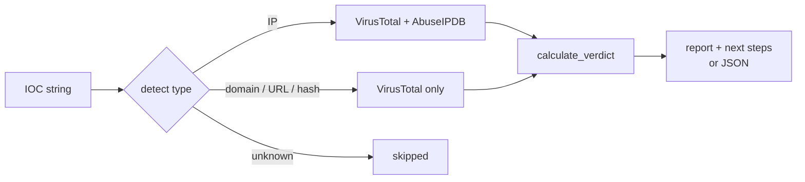

# ioc-checker

[](https://github.com/EduardoRochaFernandes/ioc-checker/actions/workflows/ci.yml)
[](LICENSE)

[](https://codespaces.new/EduardoRochaFernandes/ioc-checker)

A command-line tool that triages **IPs, domains, URLs and file hashes** against **VirusTotal** and **AbuseIPDB** and prints a short report with a verdict (True Positive / Suspicious / Likely Benign / Unknown), the reason for it, and suggested analyst next steps.

> Student project (first semester, cybersecurity degree) built while following a SOC L1/L2 learning path. It is a triage *helper*, not a replacement for analyst judgement.

## Try it in one command (no API keys)

```bash
git clone https://github.com/EduardoRochaFernandes/ioc-checker.git
cd ioc-checker
pip install -e .
ioc-checker --demo
```

Or click the Codespaces badge above, wait for the container to finish, and run `ioc-checker --demo`.

`--demo` runs seven bundled sample IOCs through the **real** parsing, verdict and report code, but the API responses are **synthetic and canned** (documentation IP ranges, `example.*` domains, invented detection names). No network, no keys, nothing is written to the cache. The full output is in [`docs/demo-output.txt`](docs/demo-output.txt).

## Sample output

Real output of `ioc-checker --demo -i 203.0.113.66` (canned data, trimmed):

```
══════════════════════════════════════════════════════════════
  IOC TRIAGE REPORT  [DEMO - canned sample data]
══════════════════════════════════════════════════════════════
  IOC   :  203[.]0[.]113[.]66
  Type  :  IP
──────────────────────────────────────────────────────────────

[ VirusTotal ]
  Detections  :  🔴  14 malicious  /  2 suspicious  /  91 vendors
  Reputation  :  -62
  Country     :  NL
  ASN         :  AS64500  —  Example Hosting B.V. (demo)

[ AbuseIPDB ]
  Confidence  :  100/100  [██████████]
  Reports     :  312  (last 90 days)
  Tor node    :  YES  ⚠

──────────────────────────────────────────────────────────────
  VERDICT  :  TRUE POSITIVE ⚠
  REASON   :  14/91 VT vendors flagged malicious | AbuseIPDB confidence 100/100 | confirmed Tor exit node
──────────────────────────────────────────────────────────────

[ Analyst Next Steps ]
  1.  Document all findings now — before escalation to L2
  2.  Search SIEM for this IOC across all hosts (last 30 days)
  ...
```

## Using it with real data

1. Get free API keys: [VirusTotal](https://www.virustotal.com/gui/my-apikey) and [AbuseIPDB](https://www.abuseipdb.com/account/api).
2. `cp .env.example .env` and fill in `VT_API_KEY` and `ABUSEIPDB_API_KEY` (the `.env` file is git-ignored; you can also just export them as environment variables). Put `.env` in the project folder.
3. Run:

```bash
ioc-checker -i 185.220.101.45                      # IP: VirusTotal + AbuseIPDB
ioc-checker -i example-domain.com                  # domain: VirusTotal
ioc-checker -i https://phishing.example/login      # URL: VirusTotal
ioc-checker -i 44d88612fea8a8f36de82e1278abb02f    # MD5 / SHA1 / SHA256: VirusTotal
ioc-checker -f iocs.txt                            # bulk, one IOC per line (see iocs.example.txt)
ioc-checker -i 8.8.8.8 --json | jq .verdict        # JSON for piping
ioc-checker -i 8.8.8.8 --no-cache                  # clear the local cache first
```

`python ioc_checker.py ...` works too. The CLI is `python ioc_checker.py -h`.

### Rate limits and terms of service

| Service | Free tier (at time of writing — check the provider) | How the tool behaves |
|---|---|---|
| VirusTotal public API | 4 requests/minute, 500/day; **not for commercial use** or business workflows | Waits 16 s between VT calls; on HTTP 429 waits 60 s and retries once. It does **not** track the daily quota. |
| AbuseIPDB free | 1000 checks/day | Reports an error on HTTP 429; no retry. |

Keep the free-tier terms in mind: use the keys for personal / learning use, don't redistribute results, and don't send confidential indicators (internal hostnames, customer file hashes) to third parties. Results are cached locally for 24 h to save quota. Bulk runs are slow on purpose (about 16 s per IOC).

## How it triages



Type detection (`detect_ioc_type`): 32/40/64 hex characters = MD5/SHA1/SHA256, then `http(s)://` = URL, then anything `ipaddress` can parse = IP, then a domain regex. For hashes the report also infers a **MITRE ATT&CK** tactic/technique from keywords in the vendors' detection names (e.g. "ransomware" → Impact / T1486). This is a keyword guess, not an analysis.

Verdict logic (`calculate_verdict`), checked top to bottom, first match wins:

| Verdict | Condition |
|---|---|
| **UNKNOWN** | The VirusTotal lookup failed (not found, missing key, timeout, HTTP error). An AbuseIPDB error alone does *not* change the verdict, it is just treated as score 0. |
| **TRUE POSITIVE** | ≥ 5 VT vendors flag it malicious, **or** AbuseIPDB confidence ≥ 75, **or** AbuseIPDB says it is a Tor exit node. All matching reasons are listed. |
| **SUSPICIOUS** | 1–4 malicious VT detections, **or** ≥ 3 VT "suspicious", **or** AbuseIPDB confidence 25–74. |
| **LIKELY BENIGN** | 0 malicious, ≤ 2 suspicious, AbuseIPDB < 25. |
| **UNKNOWN** | Fallback if nothing above matched (not reachable with the current thresholds, kept as a safety net). |

The thresholds are deliberately simple and conservative. Caveats: a Tor exit node is reported as True Positive even though Tor traffic is not necessarily malicious, and "Likely Benign" only means no feed flagged it. Always check context before blocking.

## Features

- Auto-detects IOC type; defangs IOCs in reports (`hxxp://evil[.]com`)
- VirusTotal detection stats, categories, tags, file metadata; AbuseIPDB score and Tor flag
- Verdict plus reason plus next steps tailored to IOC type and verdict
- 24 h local JSON cache, audit log (`ioc_checker.log`), JSON output, bulk mode
- Offline `--demo` mode

## Project structure

```
ioc-checker/
├── ioc_checker.py          # the tool (CLI, API clients, verdict logic, report)
├── ioc_checker_demo.py     # canned synthetic data for --demo
├── pyproject.toml          # packaging, `ioc-checker` command, ruff/pytest config
├── requirements.txt        # runtime dependencies (requests, python-dotenv)
├── .env.example            # API key template
├── iocs.example.txt        # sample bulk input
├── docs/demo-output.txt    # full output of `ioc-checker --demo`
├── tests/                  # pytest, all HTTP mocked
└── .github/workflows/ci.yml
```

## Configuration

| Variable | Purpose |
|---|---|
| `VT_API_KEY` | VirusTotal key (required for every IOC type) |
| `ABUSEIPDB_API_KEY` | AbuseIPDB key (IP lookups only) |
| `IOC_CHECKER_HOME` | Optional folder for the cache and log files (default: next to `ioc_checker.py`) |

Keys are never written to code or logs; there is no hard-coded key anywhere in the repo or its history.

## Testing

```bash
pip install -e ".[dev]"
ruff check .
pytest -q
```

68 tests, no real HTTP calls: IOC classification, defanging, MITRE inference, verdict boundaries, cache, VirusTotal/AbuseIPDB request handling (404, 429 retry, timeouts, rate-limit wait), and demo mode. CI runs them on Python 3.10, 3.12 and 3.13.

## Status and limitations

- Only VirusTotal and AbuseIPDB are supported; no other feeds.
- The tool is not tested against the live APIs in CI (no secrets there); real-mode request handling is covered with mocked responses.
- Daily quotas are not tracked (see above). Bulk lookups are sequential.
- Cache and log files are stored next to the script unless `IOC_CHECKER_HOME` is set.
- Ideas: more feeds (URLhaus, OTX), CSV export, async lookups.

## Contributing / Security

See [CONTRIBUTING.md](CONTRIBUTING.md) and [SECURITY.md](SECURITY.md). Changes are listed in [CHANGELOG.md](CHANGELOG.md).

## License

[MIT](LICENSE) © 2026 Eduardo Fernandes — [@EduardoRochaFernandes](https://github.com/EduardoRochaFernandes)
